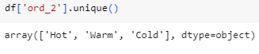

# Ex 05 Feature Encoding & Scaling
## AIM
To read the given data and perform Feature Generation process and save the data to a file.

## Explanation
Feature Generation (also known as feature construction, feature extraction or feature engineering) is the process of transforming features into new features that better relate to the target.

## ALGORITHM
### STEP 1: 
Read the given Data.
### STEP 2:
Clean the Data Set using Data Cleaning Process.
### STEP 3:
Apply Feature Generation techniques to all the feature of the data set.
### STEP 4:
Save the data to the file.
### PROGRAM
Developed by: ANISH RAJ P<br>
Register number : 212222230010

## Data.csv
```py
import pandas as pd
df1 = pd.read_csv("data.csv")
df.head()

df['Ord_1'].unique()

from sklearn.preprocessing import LabelEncoder,OrdinalEncoder
climate = ['Cold','Warm','Hot','Very Hot']
en= OrdinalEncoder(categories = [climate])
df['Ord_1']=en.fit_transform(df[["Ord_1"]])
df.head()

df['Ord_2'].unique()
cl = ['High School','Diploma','Bachelors','Masters','PhD']
en= OrdinalEncoder(categories = [cl])
df['Ord_2']=en.fit_transform(df[["Ord_2"]])
df.head()

le = LabelEncoder()
df['City'] = le.fit_transform(df[["City"]])
df.head()

from category_encoders import BinaryEncoder
be= BinaryEncoder()
data= be.fit_transform(df['bin_1'])
df= pd.concat([df,data],axis=1)
df.head()

from category_encoders import BinaryEncoder
be = BinaryEncoder()
data1 = be.fit_transform(df['bin_2'])
df= pd.concat([df1,data1],axis=1)
df
```
### Encoding data
```py
import pandas as pd
df=pd.read_csv('Encoding Data.csv')
df.head()

df['ord_2'].unique()

from sklearn.preprocessing import LabelEncoder,OrdinalEncoder
climate = ['Cold','Warm','Hot']
en= OrdinalEncoder(categories = [climate])
df['ord_2']=en.fit_transform(df[["ord_2"]])
df

le = LabelEncoder()
df['Nom_0'] = le.fit_transform(df[["nom_0"]])
df  

from category_encoders import BinaryEncoder
be = BinaryEncoder()
data = be.fit_transform(df['bin_1'])
df = pd.concat([df,data],axis=1)
df

be = BinaryEncoder()
data = be.fit_transform(df['bin_2'])
df = pd.concat([df,data],axis=1)
df
```
### BMI.csv
```py
import pandas as pd
df2 = pd.read_csv("/content/bmi.csv")
df2.head()

be = BinaryEncoder()
data2 = be.fit_transform(df2['Gender'])
df2  = pd.concat([df2,data2],axis=1)
df2

df2 = pd.get_dummies(df2, prefix=['Index'] ,columns=['Index'])
df2
```
## OUTPUT
### Data.csv
* Initial data<br>

* Unique data<br>

* Original Encoder<br>


* Label Encoder<br>

* Binary Encoder<br>


### Encoding data.csv
* Initial data<br>

* Unique data<br>

* Original Encoder<br>

* Label Encoder<br>

* Binary Encoder<br>


### BMI.csv
* Initial data<br>

* Binary Encoder<br>

* Dummies<br>

## RESULT
Thus the Feature Generation and Feature Scaling process is applied to the given data set
